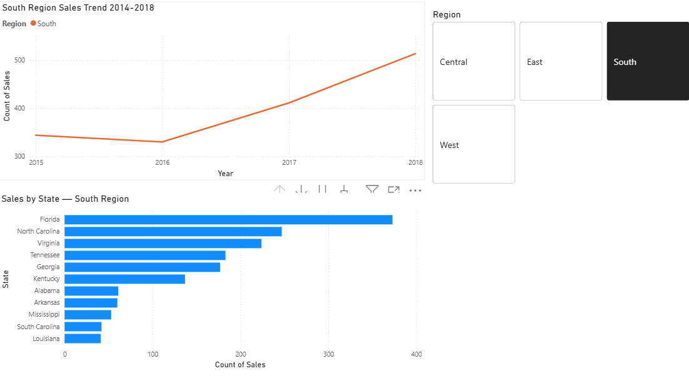

# Superstore Sales Analysis

## Business Question
Which region is underperforming and which product category is dragging it down?

## Finding
The South region underperforms across all three product categories — 
Technology, Furniture, and Office Supplies — suggesting a regional 
sales or distribution issue rather than a product-specific problem.

## Data
9,800 orders from a US retail superstore across 4 regions and 3 categories.

## Tools Used
Python, Pandas, Matplotlib, Google Colab

## Power BI Dashboard

**Finding:** South was flat until 2016 then grew consistently. 
Florida is the primary revenue driver inside the South region.
